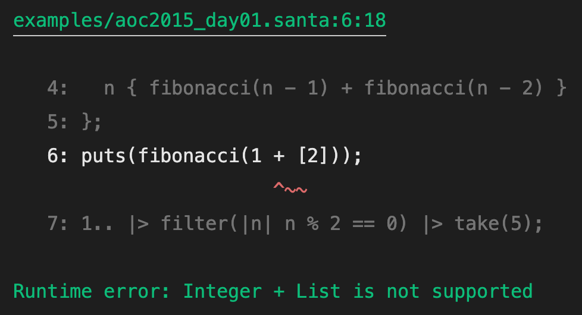

<p align="center"></p>

# santa-lang

An functional, C-like programming language for solving Advent of Code problems.

_Influenced by:_ Rust, JavaScript, F#, Scala

## Why?

Over the past several years I have been slowly working through the previous Advent of Code calendars.
For each calendar I opt to solve the problems in a new programming language, to familiarise myself with other ways of understanding and working.
However, there comes a time in each calendar that I grow to dislike some aspect of the language.
So I had an idea... why not give this whole programming langauge design a go.
That way if I grow to dislike this language, I only have myself to blame!

Welcome `santa-lang`, my [tree-walking interpreted](<https://en.wikipedia.org/wiki/Interpreter_(computing)>) programming language designed to help tackle Advent of Code problems.

## Examples

### Types

```
let int = 1;
let dec = 1.5;
let range = 1..5;
let inf_range = 1..;
let string = "Hello, world!\n";
let list = [1, 2, 3];
let hash_map = #{"a": 1, 2.5: "b", [1, 2, 3]: true, range};
let set = {1, 2, 3};
```

### Let bindings

```
let x = 1;
x = 2; // Variable x is not mutable

let mut x = 1;
x = 2;

let [x, y, _, ..z] = [1, 2, 3, 4, 5];
[x, y, z]; // [1, 2, [4, 5]]
x = 2; // Variable x is not mutable

let mut [x, y] = [1, 2];
x = 2;
```

### Functions, functions, functions!

```
let inc = +(1);
let inc = _ + 1;
let inc = |x| x + 1;

map(inc, 1..5); // [2, 3, 4, 5, 6]
filter(2 != _, 1..5); // [1, 3, 4, 5]
reduce(+, 0, 1..5); // 15
```

### Function composition and threading

```
let inc_dbl = _ + 1 >> |x| x * x;
inc_dbl(15); // 256

reduce(*, 1, map(inc_dbl, 1..5));
// vs
1..5 |> map(inc_dbl) |> reduce(*, 1); // 518400
```

### Infix function calls

Functions which accept two arguments (binary) can be called within the infix position like so:

```
contains([1, 2, 3], 3);
// vs
[1, 2, 3] `contains` 3;
```

### Lazy sequences

```
1.. |> filter(|n| n % 2 == 0) |> take(5); // [2, 4, 6, 8, 10]

zip(1.., 2..) |> map(|[x, y]| x * y) |> take(5); // [2, 6, 12, 20, 30]
```

### Recursion

```
let factorial = |n| if n == 0 { 1 } else { n * factorial(n - 1) };
```

### Closures

```
let fibonacci_seq = || {
  let mut [a, b] = [0, 1];
  || {
    let aa = a;
    a = b; b = aa + b;
    a;
  };
}();
1..5 |> each(|n| puts("> " + n + ": " + fibonacci_seq()));
// "> 1: 1"
// "> 2: 1"
// "> 3: 2"
// "> 4: 3"
// "> 5: 5"
```

### Pattern matching

```
let fibonacci = |n| match n {
  0 { 0 }
  1 { 1 }
  n { fibonacci(n - 1) + fibonacci(n - 2) }
};
```

### Spread and rest operators

```
let a = [2];
let b = [1, ..a, 3]; // [1, 2, 3]

let sum = |..xs| reduce(+, 0, xs);
sum(1, 2, 3) == sum(..b) // 6
```

### Detailed error handling



### Reimplementing `map`, `filter` and `reduce`

These fundamental functions come part of the standard library, however, they can be reimplemented on-top of the language itself like so:

```
let map = |fn, list| match list {
  [] { [] }
  [head] { [fn(head)] }
  [head, ..tail] { [fn(head), ..map(fn, tail)] }
};
```

```
let filter = |fn, list| match list {
  [] { [] }
  [head] if fn(head) { [head] }
  [head, ..tail] if fn(head) { [head, ..filter(fn, tail)] }
  [_, ..tail] { filter(fn, tail) }
};
```

```
let reduce = |fn, initial, list| {
  let recur = |acc, list| match list {
    [] { acc }
    [head] { fn(acc, head) }
    [head, ..tail] { recur(fn(acc, head), tail) }
  };
  recur(initial, list);
};
```

## Resources

- [Writing An Interpreter In Go](https://interpreterbook.com/)
- [Monkeylang](https://monkeylang.org/)
- [Crafting Interpreters](https://craftinginterpreters.com/)
- [AST Explorer](https://astexplorer.net/)
